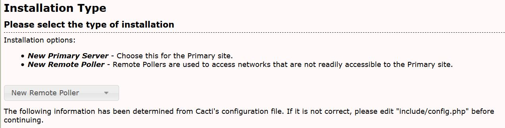

# 数据采集器

从Cacti1.x开始支持远程轮询，远程轮询允许不同的服务器监视设备，这些服务器在地理位置上会靠近被监视的节点，或者由冗余服务器进行负载平衡。

要实现这一点，主cacti实例必须与远程轮询器一起安装，并且远程轮询器是完整安装的cacti，远程轮询器必须能够访问主服务器上托管的数据库并对其进行读/写操作。为了方便查看，Cacti会在远程和主轮询器上的主轮询器仪表盘上显示所有设备。

下面的页面显示了当前的在线的采集器（也称为轮询器），通过SNMP和Ping访问设备的所有流量都来自分配给设备的轮询器。


主轮询器驻留在您登录的本地服务器上，这也可以作为使用远程轮询器的分布式系统的主轮询器。


下面的页面允许您修改特定的远程轮询器的详细信息，例如用户名和密码，您还可以测试主轮询器和远程轮询器之间的连接。


### 设置主数据库以接受来自远程轮询器的连接

为了允许远程轮询器与主轮询器通信，我们需要对mysql配置进行一些更改。

```console
mysql -u root mysql -e "GRANT ALL ON cacti.* TO cactidb@<ip of remote poller host>  IDENTIFIED BY 'password';"
mysql -u root mysql -e "GRANT SELECT ON mysql.time_zone_name TO cacti@<ip of remote poller host> IDENTIFIED BY 'password';"
```

接下来为cacti设置服务器并更新 `/cacti/include/config.php` 文件中远程数据库的详细信息和凭据。

```console
#$rdatabase_type     = 'mysql';
#$rdatabase_default  = 'cacti';
#$rdatabase_hostname = 'localhost'; <<< IP/Hostname of main server
#$rdatabase_username = 'cactiuser';
#$rdatabase_password = 'cactiuser';
#$rdatabase_port     = '3306';
#$rdatabase_retries  = 5;
#$rdatabase_ssl      = false;
#$rdatabase_ssl_key  = '';
#$rdatabase_ssl_cert = '';
#$rdatabase_ssl_ca   = '';
```

您现在需要在远程服务器上安装Cacti，选择新的远程轮询器选项。



---
Copyright (c) 2004-2020 The Cacti Group
