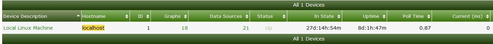

# 数据源管理

Cacti中的数据源是Cacti从设备收集数据的核心点。以下是可用于绘图的不同来源的示例：

- 通过ping监视一个设备通常将被视为1个数据源。
- 一个24端口交换机，您可以通过snmp轮询设备并绘制所有端口，这里会有24个数据源。

注意：如果添加更多基于原始数据源的数据的图形，这些数据源将不会被视为另一个数据源，因为它使用的是已经存在的源。

例如，如果您有一个24端口交换机，您为每个接口创建一个**输入/输出**流量图，然后为每个接口的输入、输出流量添加95%线，则仍然只有24个数据源。

随时了解您拥有的数据源数量是非常重要的，当拥有的数据源越多，需要分配给cacti服务器的资源就越多。

转到**管理**，然后单击**设备**，可以查看与单个设备绑定的数据源数量。



您还可以通过检查系统上的轮询器统计信息来查看数据源的总量。单击**clog**选项卡，然后类型选择 `stats` 筛选并查看下面的消息

```console
2019/05/24 17:21:11 - SYSTEM STATS: Time:9.5913 Method:spine Processes:2 Threads:2 Hosts:14 HostsPerProcess:7 DataSources:162 RRDsProcessed:117
```

这个输出告诉我们系统上有162个数据源。

### 数据源存储注意事项

系统上的数据源数量会影响所需的存储量。您还需要考虑轮询设备的速率。例如1分钟或5分钟轮询一次

下面是每个数据源可以使用的大致存储量

###### 30秒轮询

保留时间      | 文件大小 
------------- |:-------------:
Daily | 48kb
Weekly | 43kb
Monthly | 46kb
Yearly | 140kb

###### 1分钟轮询

保留时间 | 文件大小 
------------- |:-------------:
Daily | 93kb
Weekly | 45kb
Monthly | 47kb
Yearly | 140kb

###### 5分钟轮询

保留时间 | 文件大小 
------------- |:-------------:
Daily | 19kb 
Weekly | 22kb
Monthly | 25kb
Yearly | 26kb

---
Copyright (c) 2004-2020 The Cacti Group
