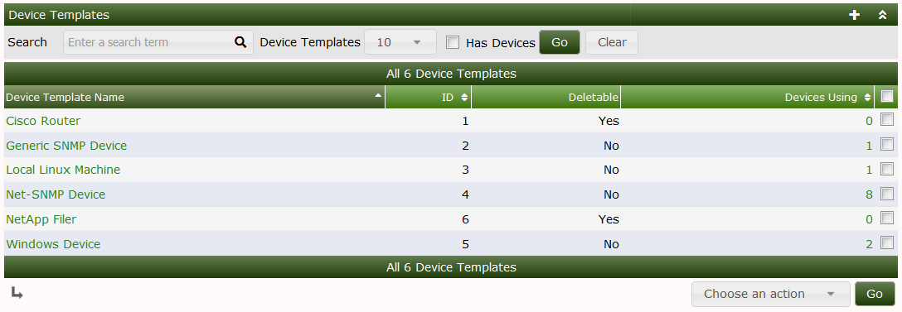
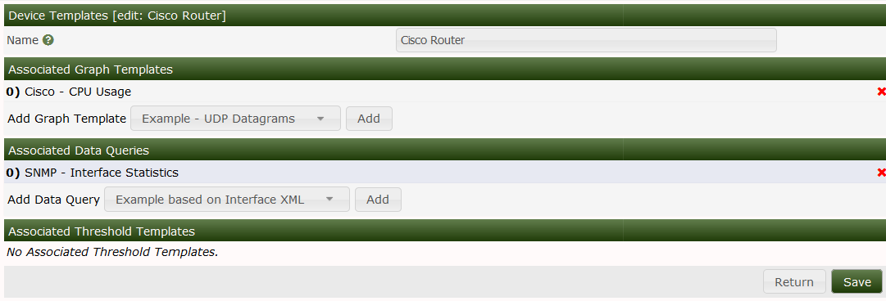

# 设备模板

**设备模板**是Cacti的对象，是一个允许您定义包括从一个到多个**图形模板**、**数据查询**和其他**插件**相关的**设备**的类别的对象类型。

**设备模板**的目的是通过预先定义为添加到Cacti中的每个**设备**创建的**图**来简化**自动化**过程。它们与**自动化模板**一起工作，这样当Cacti发现一个**网络**时，它就知道要为每个**设备**创建什么**图**。

**设备模板**主界面如下图所示：

从这个页面，您可以看到每个**设备模板**的标题，**设备模板**的ID对于Cacti的CLI脚本非常重要。您可以看到**设备模板**是否可以删除，以及使用**设备模板**的**设备**的数量。

无法删除有设备正在使用的模板，如果您尝试删除一个正在被使用的模板，您将收到和错误消息。

从下拉列表中有三个选项，它们是：

选项 | 描述 
--- | ---
Delete | 如果设备模板可删除怎可以删除该模板 
Duplicate | 复制设备模板 
Sync Devices | 通过使用最新的定义，添加但是不删除图形模板和数据查询的方式更新所有使用这个设备模板的设备 

编辑**设备模板**时，会看到如下页面。在此页面中，您可以添加和删除**图形模板**，**数据查询**，以及其他**插件**对象。在下图中，您可以看到 *Cisco Router* 有一个叫做 *Cisco-CPU Usage* 的图形模板和一个叫做 *SNMP-Interface Statistics* 的数据查询模板。系统上没有定义**阈值模板**，因此这里无法选择。

要将**图形模板**或**数据查询**添加到**设备模板**中，只需从下拉列表中选择它，然后按 `添加` 按钮，之后不需要保存。要删除其中一项，只需单击所需**图形模板**或**数据查询**右侧的 `x` 字形即可。

---
Copyright (c) 2004-2020 The Cacti Group
