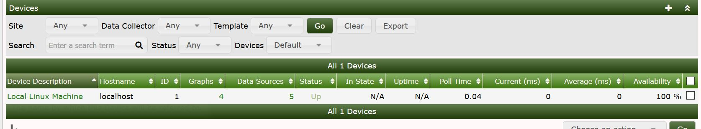

# 设备管理

本节将介绍Cacti中的**设备**管理。

可以通过例如GUI、自动化、CLI等不同的方式向Cacti添加设备。

## GUI选项

要通过GUI添加设备，请首先单击**控制台**>>**管理**>>**设备**，然后您将看到下面的设备控制台窗口，其中将显示已经添加的设备（如果有设备的话）。



现在您将选择右上角的+号添加设备


一旦您选择了+或者添加设备按钮，您将看到下面的界面，在这个界面需要提供特定于设备的信息

在这个界面中需要的有关设备的最重要信息包括：

- 描述（一般为设备名称）
- 主机名（IP或者域名）
- 设备模板
- SNMP选项
- 设备注释


Cacti需要这些基本信息来监控设备。输入完成，单击右下角的`保存`。创建设备后，您需要通过单击右上角的**为此设备创建图形**来添加设备的图形。

## 通过CLI脚本创建设备

您还可以使用位于`/cactidir/cli/`的CLI脚本命令来创建设备

```console
usage: add_device.php --description=[description] --ip=[IP] --template=[ID] [--notes="[]"] [--disable]
    [--poller=[id]] [--site=[id] [--external-id=[S]] [--proxy] [--threads=[1]
    [--avail=[ping]] --ping_method=[icmp] --ping_port=[N/A, 1-65534] --ping_timeout=[N] --ping_retries=[2]
    [--version=[0|1|2|3]] [--community=] [--port=161] [--timeout=500]
    [--username= --password=] [--authproto=] [--privpass= --privproto=] [--context=] [--engineid=]
    [--quiet]

Required:
    --description  the name that will be displayed by Cacti in the graphs
    --ip           self explanatory (can also be a FQDN)
```

使用最少的信息添加一个设备，如下所示

```console
$ php add_device.php --description=test --ip=192.168.1.15
Adding test (192.168.1.15) as "Cacti Stats" using SNMP v3 with community "public"
Success - new device-id: (45)
```

---
Copyright (c) 2004-2020 The Cacti Group
