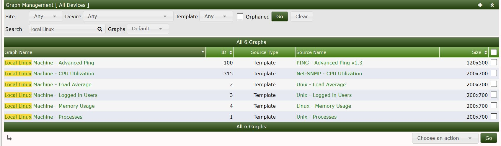
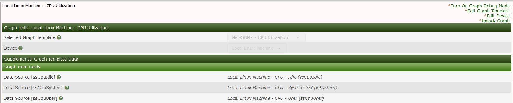
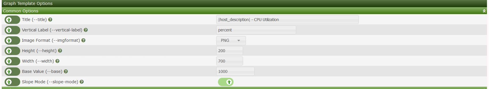

# 图形管理

本节将介绍Cacti中的**图形**管理。

Cacti提供了一种通过控制台查看每个设备的图形的方法。这允许管理员查看附加到特定设备的图形。也可以按图形类型进行搜索。下面是搜索出的与本地linux服务器相关联的图。

单击列表中的一个图形将显示以下菜单。在此菜单中，您可以对特定的图形启用调试模式，还可以更改图形的模板等。

### 修改图形模板

Cacti允许您在多个方面更改图形模板。您可以更改例如图形的标题以及图形的大小等参数。

这些更改将被推送到图形模板，以便使用该模板的其他设备也被更新。

---
Copyright (c) 2004-2020 The Cacti Group
