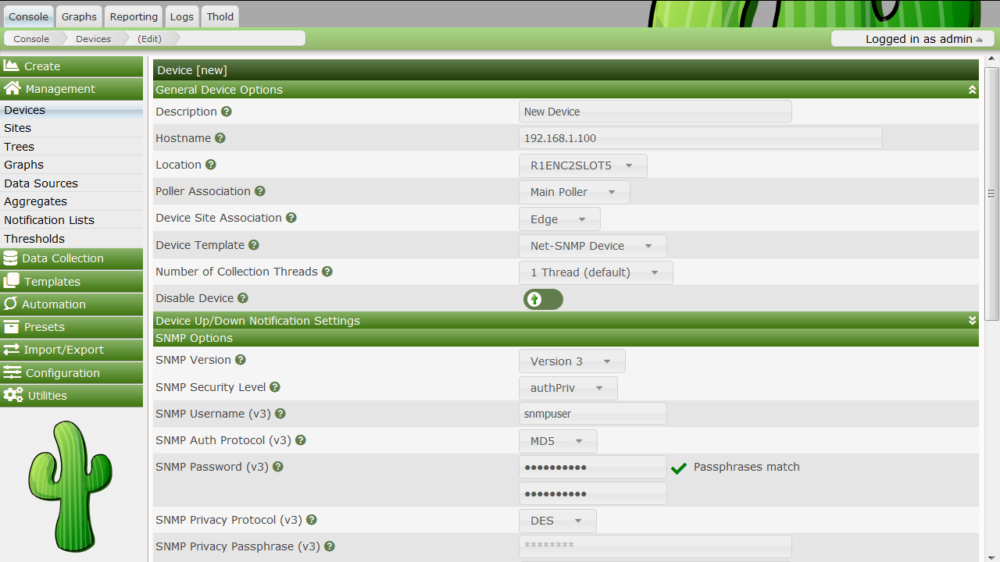

# 如何绘制网络图

在这一点上，你可能意识到绘图是Cacti最擅长的。Cacti有许多强大的功能可以提供复杂的绘图和数据采集，有些可能有轻微的学习难度。但是不要让它阻碍你，因为绘制你的网络图非常简单。

接下来的两个部分将讲述为大多数设备创建图形所需的两个基本步骤。

## 创建设备

为网络创建图形的第一步是为想要创建图形的每个网络设备进行添加设备操作。设备需要指定一些重要的信息，如网络主机名、SNMP参数和主机类型等。

要管理Cacti中的设备，请单**设备**菜单项。单击**添加**将显示一个新的设备窗体。前两个字段`Description`和`Hostname`是需要您输入的非默认值的字段。如果您的`设备模板`是在设备模板下拉列表下定义的，请确保在此处选择它。如果只是绘制流量图，则始终可以选择“Generic SNMP Host”（通用SNMP主机），如果不确定，则选择“None”（无）。请记住，您选择的主机模板不会将您锁定在任何特定的配置中，它只会为该类型的主机提供更智能的默认值。



### 设备字段定义

- **Description** - 此说明将显示在设备列表的第一列中。你可以在图表标题中引用它。
  
- **Hostname** - IP地址或主机名。主机名将使用标准主机解析机制解析，例如动态名称服务（DNS）
  
- **Host Template** - 主机模板是与此主机相关的图形模板列表的容器。
  
- **Notes** - 设备的注释。

- **Disable Device** - 从轮询中排除此主机。这是特别有的价值如果一个设备不再可用但还需要保留，例如作为查阅记录。

### 可用性/可达性选项

- **设备宕机探测**
  - ___NONE___ - 停用宕机主机检测
  - ___SNMP___ - 通过检查OID`.1`和`.1.3`核查SNMP
  - ___ICMP___ - 执行ping测试，见下文
  - ___PING and SNMP___ - 执行ping和SNMP测试

- **Ping Method** - 仅适用于***PING和SNMP***或***PING***
  - ___ICMP___ - 执行ICMP测试。需要权限
  - ___UDP___ - 执行UDP测试。
  - ___TCP___ - 执行TCP测试。

- **Ping Port** - 仅适用于UDP/TCP PING测试类型。请在此定义要测试的端口。确保没有防火墙拦截测试ping。
  
- **Timeout Value** - 在指定时间之后测试失败。以毫秒为单位
  
- **Ping Retry Count** - Cacti在失败前尝试ping主机的次数

### SNMP 选项

- **SNMP 版本**
  - ___Version 1___ - 使用SNMP版本1。请注意，此SNMP版本不支持64位计数器。
  - ___Version 2___ - 在大多数SNMP文档中称为SNMP V2c
  - ___Version 3___ - SNMP V3，支持身份验证和加密
  
- **SNMP Community** - 此设备的SNMP read community。

- **SNMP Port** - 用于SNMP的UDP端口号（默认值为161）。

- **SNMP Timeout** - Cacti等待SNMP响应的最大毫秒数（不支持php SNMP）
  
- **每个获取请求的最大 OID*** - 这是一种工作特性。指定在单个SNMP Get请求中可以获得的OID的数量。
  ***WARNING***：此功能仅在使用Spine时有效
  ***WARNING***：某些设备不支持大于`1`的值，并且如果该值太高，可能会崩溃。

### SNMP V3的安全选项

- ***SNMP Username*** - SNMP V3 `createUser` 语句或等效语句的用户名
  
- ***SNMP Password*** - SNMP V3 `createUser` 语句或等效语句的`authpassphrase` 
  
- ***SNMP Auth Protocol*** - SNMP V3 `createUser`语句或等效语句的身份验证类型。选择MD5或SHA。默认为MD5。
  
- ***SNMP Privacy Passphrase*** - SNMP V3 `createUser`语句或等效语句的`privacy passphrase`。
  
- ***SNMP Privacy Protocol*** - SNMP V3 `createUser`语句或等效语句的“privacy protocol”。选择DES或AES。默认为DES。
  
- ***SNMP Context*** - 使用基于视图的访问控制模型（VACM）时，可以使用`com2sec`指令、`group`指令和`Access`指令将团体名称映射到安全名称时指定SNMP上下文。这允许定义特殊的访问模型。如果在目标的SNMP配置中使用这样的参数，请在此处指定用于访问该目标的上下文名称

保存新设备后，您应该被重定向回相同的编辑表单，并提供一些附加信息。如果通过提供有效的团体字符串为此主机配置了SNMP，则应在页面顶部看到列出的各种统计信息。如果您看到的是`SNMP错误`，则表明Cacti和您的设备之间存在SNMP问题。

页面底部将有两个添加框，关联的数据查询和关联的图形模板。如果您在上一页中选择了一个主机模板，则每个框中可能会有几个项目。如果两个框中没有列出任何内容，则需要将至少一个数据查询或图形模板与新设备关联，否则无法在下一步中创建图形。如果没有可用的图形模板或数据查询应用于您的设备，您可以检查Cacti模板存储库，或者创建您自己的（如果当前不存在）。


### SNMP简介

您选择的SNMP版本对SNMP在Cacti中的工作方式有很大的影响。除非您有理由选择其他，否则版本1应该用于所有事情。如果计划使用（并且您的设备支持）64位计数器，则必须选择版本2。从Cacti 0.8.7开始，版本3已经完全实现。

从主机查询SNMP信息的方式对支持哪些SNMP相关选项有直接影响。目前在Cacti中有三种类型的SNMP查询方法，概述如下：

#### SNMP查询类型

| 类型        | 描述            | 支持的选项 | 用于何处 |
|---------------|--------------------------|---------------------|------------|
| External SNMP | 调用系统上安装的net snmpwalk和snmpget二进制文件。 | 支持所有SNMP选项 | Web界面和PHP轮询器 |
| Internal SNMP | 使用PHP的SNMP函数，这些函数在编译时链接到`net-snmp`。 | 只支持SNMP V1的选项 | Web界面和PHP轮询器 |
| Spine SNMP   | 直接链接到`net-snmp`并直接使用SNMP API。 | 支持所有SNMP选项 | Spine轮询器 |

### SNMP V3选项说明

当使用SNMP V3时（被称为*基于视图的访问控制模型（VACM）*），SNMP支持身份验证和加密功能。这要求目标设备支持并配置为snmp v3。

通常，V3选项的配置取决于目标类型。以下引用自`man snmpd.conf`关于用户定义的内容

```sh
SNMPv3 Users
    createUser [-e ENGINEID] username (MD5|SHA) authpassphrase [DES|AES] [privpassphrase]

           MD5 and SHA are the authentication types to use.  DES and AES are the privacy
           protocols  to  use. If  the  privacy  passphrase  is not specified, it is assumed
           to be the same as the authentication passphrase.  Note that the users created will
           be useless unless they are also added  to  the  VACM access control tables
           described above.

           SHA  authentication  and DES/AES privacy require OpenSSL to be installed and the
           agent to be built with OpenSSL support.  MD5 authentication may be used without
           OpenSSL.

           Warning: the minimum pass phrase length is 8 characters.
```

 `man snmpd.conf`中对于VACM指令的解释如下：

```sh
VACM Configuration
    The full flexibility of the VACM is available using four configuration directives -
    com2sec, group,  view and access.  These provide direct configuration of the underlying
    VACM tables.

    com2sec  [-Cn CONTEXT] SECNAME SOURCE COMMUNITY
           map  an  SNMPv1 or SNMPv2c community string to a security name - either from a
           particular range of source addresses, or globally ("default").  A restricted
           source can either be a specific  hostname (or  address), or a subnet -
           represented as IP/MASK (e.g. 10.10.10.0/255.255.255.0), or IP/BITS
           (e.g. 10.10.10.0/24), or the IPv6 equivalents.

           The same community string can be specified in several separate directives
           (presumably with different  source  tokens), and the first source/community
           combination that matches the incoming request will be selected.  Various
           source/community combinations can also map to the same security name.

           If a CONTEXT is specified (using -Cn), the community string will be mapped
           to a security  name  in the named SNMPv3 context. Otherwise the default
           context ("") will be used.

    group GROUP {v1|v2c|usm} SECNAME
           maps  a  security name (in the specified security model) into a named group.
           Several group directives can specify the same group name, allowing a single
           access setting to apply to several  users and/or community strings.

           Note  that  groups must be set up for the two community-based models separately -
           a single com2sec (or equivalent) directive will typically be accompanied by two
           group directives.

    view VNAME TYPE OID [MASK]
           defines a named "view" - a subset of the overall OID tree. This is most commonly
           a single subtree, but  several view directives can be given with the same view
           name, to build up a more complex collection of OIDs.  TYPE is either included
           or excluded, which can again define a more complex view (e.g by excluding certain
           sensitive objects from an otherwise accessible subtree).

           MASK is a list of hex octets (separated by . or :)
           with the set bits indicating which subidentifiers in the view OID to match against.
           This can be used to define a view covering a particular row (or  rows) in a table.
           If not specified, this defaults to matching the OID exactly (all bits set), thus
           defining a simple OID subtree.

    access GROUP CONTEXT {any|v1|v2c|usm} LEVEL PREFX READ WRITE NOTIFY
           maps from a group of users/communities (with a particular security model
           and  minimum  security level, and in a specific context) to one of three views,
           depending on the request being processed.

           LEVEL is one of noauth, auth, or priv.  PREFX specifies how CONTEXT should be
           matched against  the context  of  the  incoming  request, either exact or prefix.
           READ, WRITE and NOTIFY specifies the view to be used for GET*, SET and
           TRAP/INFORM requests (although the NOTIFY view is not currently used).  For
           v1 or v2c access, LEVEL will need to be noauth.
```

例如，snmpd配置中的以下信息创建了一组用于snmp v3的定义

```ini
# sample configuration for SNMP V3

# create an SNMP V3 user with an authpassphrase and a privacy passphrase
##         username   authProto  authpassphrase  privProto  privpassphrase
##         --------   ---------  --------------  ---------  --------------
createUser gandalf    MD5        myauthpass      DES        myprivpass


# Second, map the security name into a group name:
##    groupName    securityModel  securityName
##    ---------    -------------  ------------
group groupv3      usm            gandalf


# Third, create a view for us to let the group have rights to:
##          incl/excl  subtree   mask
##          ---------  -------   ----
view    all included   .iso      80


# Fourth, create the access for that group without context
##                context sec.model sec.level prefix read   write  notif
##                ------- --------- --------- ------ ----   -----  -----
access groupv3    ""      any       auth      exact  all    all    all
```

将这些内容添加到snmp配置中时，请记住要重新启动代理。使用如下命令验证此设置：

```sh
shell>snmpwalk -v 3 -a MD5 -A myauthpass -x DES -X myprivpass -u gandalf -l authpriv localhost interface
IF-MIB::ifNumber.0 = INTEGER: 3
IF-MIB::ifIndex.1 = INTEGER: 1
IF-MIB::ifIndex.2 = INTEGER: 2
IF-MIB::ifIndex.3 = INTEGER: 3
IF-MIB::ifDescr.1 = STRING: lo
IF-MIB::ifDescr.2 = STRING: irda0
IF-MIB::ifDescr.3 = STRING: eth0
IF-MIB::ifType.1 = INTEGER: softwareLoopback(24)
IF-MIB::ifType.2 = INTEGER: other(1)
IF-MIB::ifType.3 = INTEGER: ethernetCsmacd(6)
...
```

## 创建图形

现在您已经创建了一些设备，现在是时候为这些设备创建图形了。为此，请选择**创建**标题下的**新建图形**菜单选项。如果您仍然在设备编辑屏幕，请选择**为设备创建图形**以查看与下图类似的屏幕。


应该使用包含每个设备的下拉菜单来选择要为其创建新图形的主机。这个页面很简单，在要为其创建图形的每一行中放置了一个复选框，选中复选框，然后单击**创建**。

如果要在`数据查询`框中创建图形，还需要记住一些额外的事项。首先，您可能会遇到如上图所示的`SNMP-Interface Statistics`数据查询。如果出现这种情况时，您可能需要查阅有关调试数据查询的部分，以了解为什么数据查询没有返回任何结果。此外您可能会在一些数据查询框下看到`选择要创建的图形类型`下拉框。更改此下拉框的值会影响单击“创建”按钮后Cacti将生成的图形类型。Cacti只在有多个类型可供选择时显示此下拉框，因此它可能并非在所有情况下都显示。

一旦选择了要创建的图形，只需单击页面底部的 `创建` 按钮。您将进入一个新页面，该页面允许您指定有关要创建的图的其他信息。您只能看到不是来自模板的那一部分的字段值，否则值将使用模板自动填充。当这个页面上的所有值看起来都正确时，最后一次单击 `创建` 按钮来实际创建图形。

如果要在图形创建后编辑或删除图形，请使用菜单上的**图形管理**项。同样，**数据源**菜单项允许您在Cacti中管理数据源。

---
Copyright (c) 2004-2020 The Cacti Group
