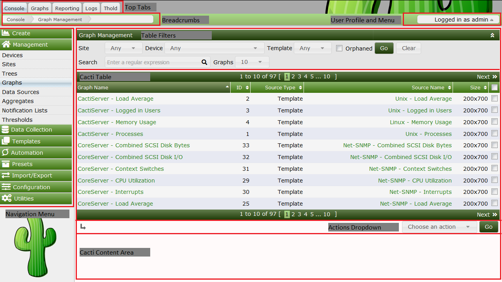

# Cacti图形化界面总览

Cacti用户界面在视图上分为多个部分。通过单击**顶部选项卡**，可以导航到每个主要部分。默认情况下，Cacti有四个主要部分，分别是*Console*、*Graphs*、*Reporting*和*Logs*，不过管理员可以通过安装和启用**插件**或向Cacti添加**外部链接**来添加额外的**顶部选项卡**部分。

在每一个部分中，该页面被分成若干小节。这些子部分包括 **导航区域** 和 **内容区域** 。

所有页面都包含**面包屑**区域、**用户配置文件**和**菜单**区域，在某些主题中还包括**页脚**区域。此外在某些**主题**中，**面包屑**区域是隐藏的。

要正确使用Cacti，您首先应该了解这些部分。我们将从描述Cacti控制台开始。

## Cacti控制台顶部选项卡

下图是Cacti **控制台** 的截图。从Cacti控制台，我们可以看到许多用户界面区域。

- **顶部选项卡（Top Tabs）**

  Cacti**顶部选项卡**为Cacti提供多个**导航区域**。默认情况下，Cacti包含四个**顶部选项卡**。它们是**控制台**、**图表**、**日志**和**报告**。
  
- **面包屑（Breadcrumbs）**

  **面包屑**直接出现在**顶部选项卡**的下方。需要注意有些Cacti主题会禁用**面包屑**。如果需要，您可以单击**面包屑**区域导航到该区域。
  
- **Cacti内容区域（Cacti Content Area）**

  这是显示主要内容的地方。它就在面包屑或顶部选项卡的下面。通过 **外部链接** 可以包含 **插件作者** 或Cacti管理员想要的任何HTML页面。
  
- **导航菜单（Navigation Menu）**

  如果您单击Cacti的**控制台**，会看到一个**导航菜单**示例。除了Cacti**控制台**之外，这些菜单还可以出现在任何基于插件的**顶部选项卡**页面上。
  
- **数据展示区（Cacti Tables）**

  这些列表是在Cacti中呈现基于表单的数据的地方。**Cadcti内容展示**是使用一个神秘但易用的的API呈现的。
  
- **筛选框（Table Filters）**

  任何**数据展示区**都可以包含**筛选框**。这些筛选可用于限制返回到**数据展示区**的数据。
  
- **动作下拉列表（Actions Dropdown）**

  所有包含**数据展示区**的页面通常都会包含一个**动作下拉列表**。这些**动作下拉列表**菜单允许您对一个或多个数据行执行操作。
  
- **用户配置文件和菜单（User Profile and Menu）**

  在这里，可以编辑用户配置文件、更改密码、注销或查找指向其他Cacti信息和支持的链接。

像Cacti Guest帐户这样的普通用户，不应访问Cacti**控制台**。

## Cacti图形顶部选项卡

Cacti图形**顶部选项卡**是查看大多数Cacti**图**的地方。默认情况下，Cacti图**顶部选项卡**包含三个不同的视图。它们包括：

- **树形视图（Tree View）**

  此视图允许Cacti用户以层次结构**树**的形式查看**图**。这些**树**通常由Cacti管理员构建，在**用户**或**用户组**级别进行控制。
  
- **预览视图（Preview View）**

  **预览视图**提供了Cacti用户可以访问的所有**图形**的视图。**筛选框**用于约束返回到页面的**图**列表。
  
- **列表视图（List View）**

  **列表视图**允许Cacti用户从不同的页面中选择图形创建自己的**预览页**，然后最终从**预览视图**查看这些页面。

在下面的**树视图**示例页面中，可以看到左侧的**树导航区**，在**Cadcti内容区**中，可以看到**图**和一个**筛选框**区域，用于约束返回的**图**列表。可以从**树导航区域**上方的**搜索**区域搜索树形视图。

---
Copyright (c) 2004-2020 The Cacti Group
