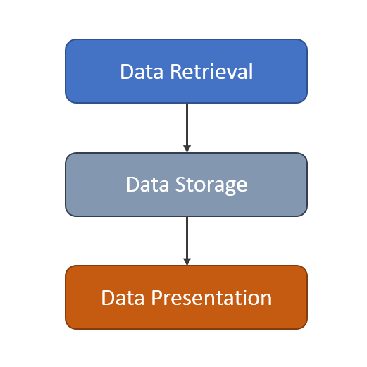
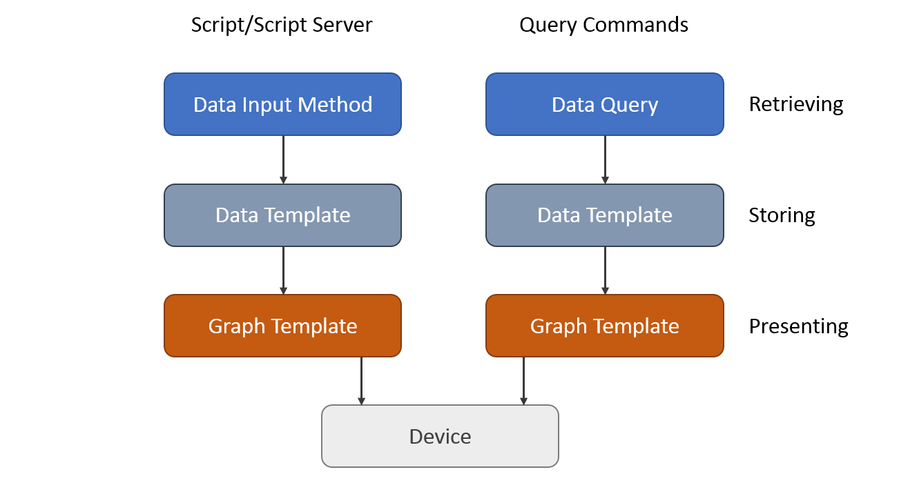

# 工作原理

Cacti操作可分为三个不同的任务：

## 数据收集

第一个任务是收集数据。Cacti使用轮询器（Poller）来获取数据。轮询器是使用操作系统的调度程序来执行的，例如类Unix操作系统的定时任务。

在现在的IT环境中，您要处理许多不同类型的设备，例如服务器、网络设备、应用等等。cacti主要使用SNMP（简单的网络管理协议）来从目标主机获得数据。因此，所有能够使用SNMP的设备都可以被cacti监控。

稍后，我们将演示如何将Cacti的数据收集功能扩展到脚本、脚本查询等。

## 数据存储

数据的存储有很多不同的方式。有些可能使用数据库存储数据，有些可能使用普通文件存储数据。Cacti则使用RRDTool存储数据。

RRD是循环数据库的缩写。RRD是一个存储和显示时间序列数据（例如网络带宽、机房温度、服务器平均负载）的系统。它以一种非常紧凑的方式存储数据，不会随着时间的推移而扩展文件大小，并且可以创建漂亮的图形。这就避免了存储不足的情况。

同样，RRDTool将执行一些特定的任务。它可以将原始数据合并到合并数据中。这样，历史数据被压缩以节省空间。RRDTool支持不同的合并函数：平均值、最大值、最小值和最新值。

## 数据展示

RRDTool最受欢迎的特性之一是内置的绘图功能。这在将其与一些常用的web服务器结合时非常有用。这样，就可以从任何平台上的任何浏览器访问图形。

绘图可以用各种不同的方式完成。可以在一个图中绘制一个或多个项目。支持自动缩放和对数y轴。你可以将项目堆叠到另一个项目上，然后打印一些漂亮的图例，表示诸如最小值、平均值、最大值等特征值。

## 扩展内置功能

脚本和查询可以将Cacti的功能扩展到SNMP之外。它们允许使用自定义代码进行数据检索。这不局限于某种编程语言；您可以找到php、perl、shell/batch等等语言写编写的代码。

这些脚本和查询由Cacti的poller在本地执行。但是它们可以通过不同的协议从远程主机上检索数据，例如：

协议 | 描述 
--- | ---
ICMP | ping以测量往返时间和可用性 
telnet | 编写telnet脚本以检索仅对系统管理员可用的数据 
ssh | 和telnet相似，但更安全（也更复杂） 
http(s) | 调用远程cgi脚本通过web服务器检索数据或解析web页面以获取统计数据 （例如网络打印机等） 
snmp | 使用net-snmp的exec/pass函数调用远程脚本并获取数据 
ldap | 检索ldap服务器活动的统计信息 
use your own | 例如调用nagios代理 

以及更多协议。。。

有两种方法可以扩展Cacti的内置功能：

[数据输入方法（Data-Input-Methods）](Data-Input-Methods.md)：用于查询**单个或多个非索引**的数据

- 温度、湿度、风量等
- cpu，内存使用率
- 登录用户数
- IP数据，如ipInReceives（每个主机接收的IP包数）
- TCP数据，如tcpActiveOpens（TCP打开的套接字数）
- UDP数据，如udpInDatagrams（接收的UDP包数）

[数据查询（Data-Queries）](Data-Queries.md)：用于可以使用**索引**的数据

- 网络接口数据，例如流量、错误包、丢弃的包
- 其他SNMP数据，例如用于磁盘使用的hrStorageTable数据
- 甚至可以将数据查询创建为脚本，例如用于查询域名服务器的每个域的请求数

通过使用导出和导入工具，可以与其他人共享您的数据。

---
Copyright (c) 2004-2020 The Cacti Group
