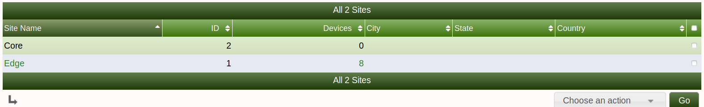
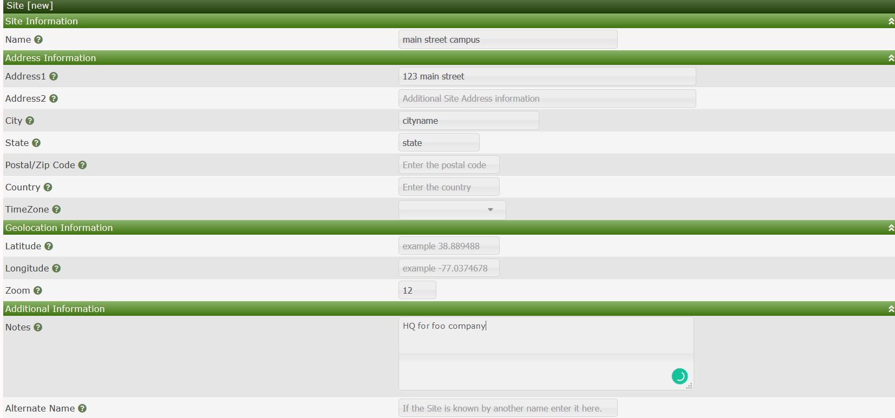
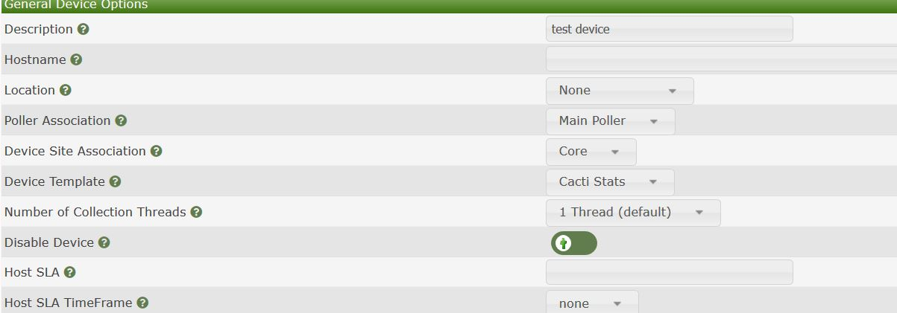
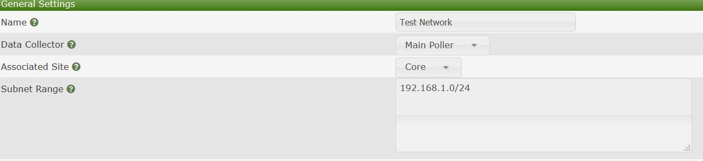

# 站点管理

本节将介绍Cacti的**站点**管理。

Cacti中的站点可以将公司的位于不同位置的设备根据位置的不同分割开来。例如，您可以有一个名为**123号街**的站点，在该站点中，您可以将位于该物理位置的所有设备与Cacti站点相关联。这个站点可以是客户站点或数据中心的位置。

下面是您可以为站点或者位置输入的一些属性数据的示例。

为站点输入适当的信息，然后单击右下方的`创建`。

在手动创建设备时创建了站点之后，可以将设备与站点关联起来。

您还可以通过自动化将发现的设备与特定站点关联起来。

---
Copyright (c) 2004-2020 The Cacti Group
