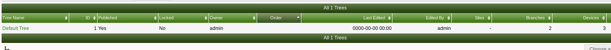
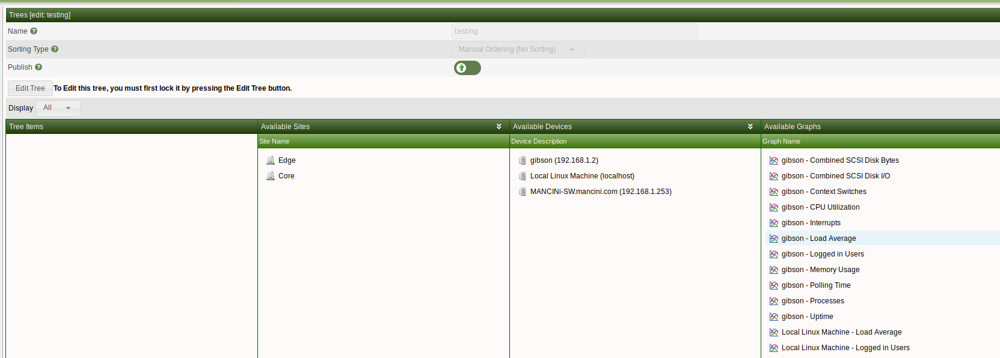

# 树管理

本节将介绍Cacti中的**树**管理。

cacti中的树用于放置图形，树上的设备按名称组织。

下面我们可以看到在cacti服务器上设置的树。要进入此屏幕，请单击**控制台**>>**管理**>>**树**。

在这个页面中，您可以根据需要添加或删除树

下面是如何在图形视图中显示树。我们可以看到正在监控的设备——单击此设备可以看到为该设备生成的所有图形数据。

要创建一个新的树，只需单击右上角的 `+` 并输入树的名称。创建树之后，您将看到下面的页面，您可以在其中向树添加设备。

要将设备添加到新树中，只需将可用设备拖到树上，它就会被添加到树中。

---
Copyright (c) 2004-2020 The Cacti Group
