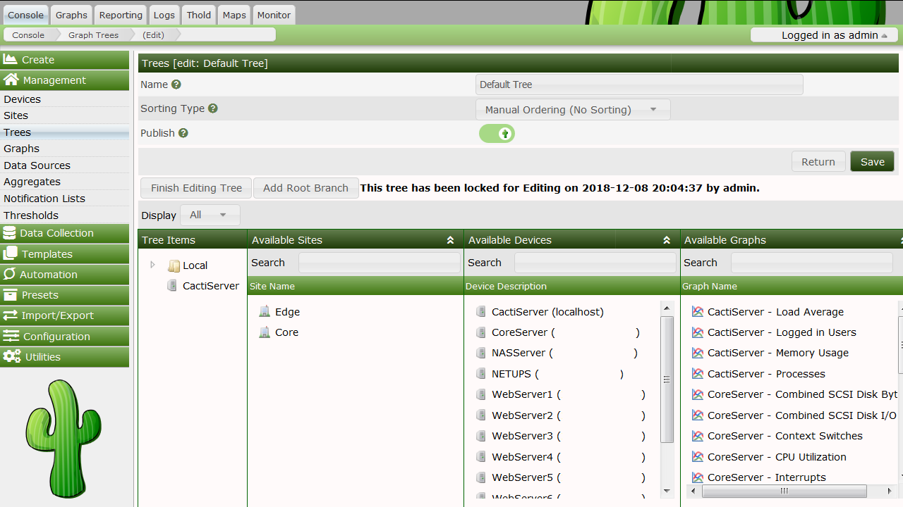

# 查看图形

## 图形树

图形树可以被认为是组织图形的一种分层方式。每个图树由零个或多个根或分支节点组成，这些节点包含图或树等叶节点。一棵树中的多个图树或分支可以组合起来形成一种非常强大的组织图的方法。

## 创建图形树

要创建新的图形树，请选择**管理**标题下的**树**菜单项。选择此页上的 `添加` 以创建新树。接下来的的页面将提示您输入一个用于在整个Cacti中标识树的树名。除了名称之外，您还可以从当前支持的四种排序类型中选择一种。

###### 排序类型

排序类型 | 示例 | 说明 
--- | --- | ---
手动排序（不排序） |  | 你可以随意改变顺序 
字母排序 |  1, Ab, ab | 所有的子树都是按字母顺序排序的，除非另有规定（您可能会在子树标签上偶然选择排序选项） 
自然排序 | ab1, ab2, ab7, ab10, ab20 | N/A
数字排序 | 01, 02, 4, 04 | 数字排序时不考虑前导零 

输入名称后，单击 `创建` 按钮继续。您将被重定向到与下面类似的页面，但没有任何内容。

---
Copyright (c) 2004-2020 The Cacti Group
